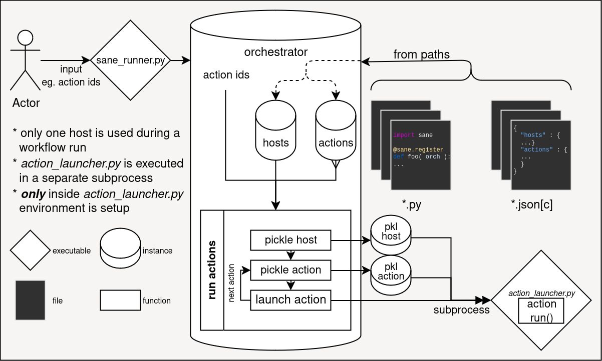

# SANE Workflows
Simple Action 'n Environment Workflow

SANE is a DAG-based action workflow runner augmented with environments provided
by hosts.

It provides:
  * DAG-based action mapping, with statefulness to preserve runs
  * both python and JSON config based workflow management
  * sourcing workflows from multiple directories
  * resource management between host and actions
  * HPC-resource enabled hosts (PBS base fully implemented)
  * environment variable manipulation via shell scripts, lmod, and explicit setting
  * extensible `Host`, `Environment`, and `Action` classes that can be derived from
    * derived classes allowed within user workflow directories
    * derived classes accessible within user JSON configs
  * a priority-based python registration decorator
  * a priority-based JSON patching feature

## Overview

Below is a high level overview of how running a workflow works. Many of the complex
nuances, such as type finding, HPC submission, resource management, etc., are left out.

The focus should instead be:
  * a single _orchestrator_ manages the workflow
  * a node in the DAG-workflow is an _action_
  * a _host_ provides _environments_ for an _action_
  * _actions_ are run independently in an order informed by DAG dependencies
  * an _action_ itself is `run()` in a totally separate subprocess (not python subprocess!)
  * instance information is transferred via python pickling



## Python Usage
To utilize `sane` in a python setting, create a python file (module) and import the
`sane` package. Assuming you are running via the provided entry point `sane_runner.py`,
you do not need to ensure `sane` is within your `PYTHONPATH`. Afterwards, to add,
remove, or modify the _orchestrator_ use the `@sane.register(priority=0)` decorator.
Providing a priority is optional, and if no priority is given, no `()` call is necessary,
as seen below. The _orchestrator_ is provided as the single argument to the decorated
function.

```python
import sane

@sane.register
def my_workflow( orch ):
  my_action = sane.Action( "id" )
  orch.add_action( my_action )
```

If a priority is given, functions will be evaluated in descending order (highest
priority first)
```python
import sane

@sane.register
def last( orch ):
  # defaul priority is 0
  pass

@sane.register( priority=5 )
def second( orch ):
  pass

@sane.register( 99 )
def first( orch ):
  pass
```

## JSON Usage
To utilize `sane` in a JSON config file setting, create a JSON file (config) that
contains at least one of the keys : `"hosts"`, `"actions"`, or `"patches"`. Refer
to the `docs/template.jsonc` on what default fields are appropriate. Note that if
you define your own type (and thus add your own `load_extra_config()`), additional
fields may be provided in the config.
```jsonc
{
  "hosts" :
  {
    "dummy" : { "environment" : "generic" }
  },
  "actions" :
  {
    "my_action" :
    {
      "config" : { "command" : "echo", "arguments" : [ 1 ] },
      "environment" : "generic"
    }
  }
}
```

By default, you may utilize _action_ attributes inside of the generic `"config" : {}`
dictionary field. The attributes are automatically scoped to the current _action_
and are accessed via YAML-like dereferencing (`${{}}`):
```jsonc
// ... previous config
  "actions" :
  {
    "my_action" :
    {
      "config" : { "command" : "echo", "arguments" : [ "${{ id }}" ] }
    }
  }
// ... rest of config
```
